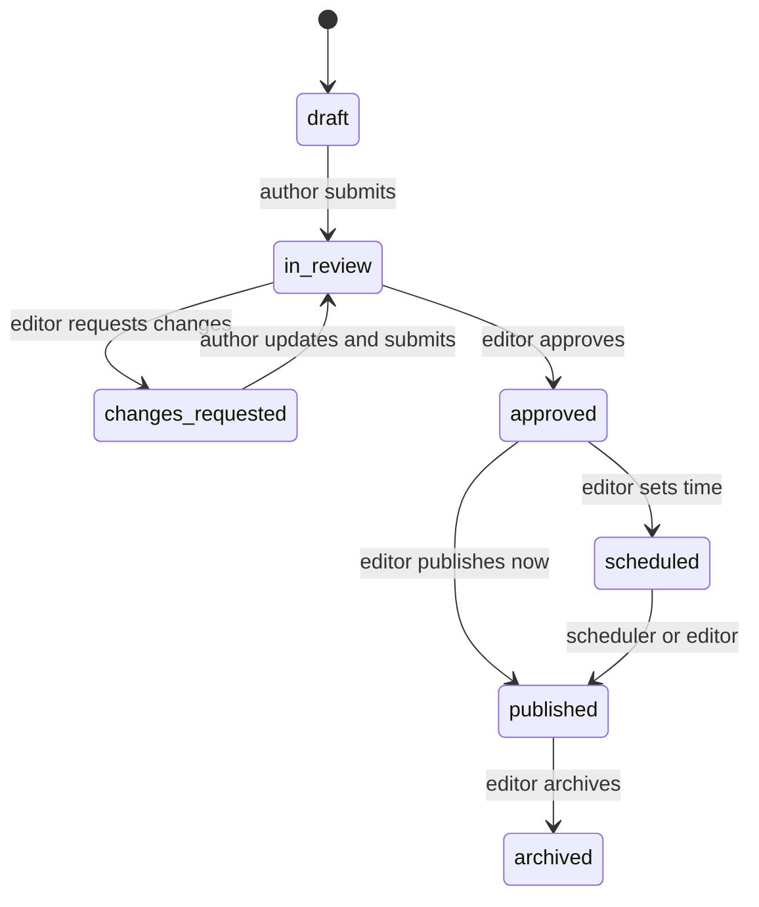
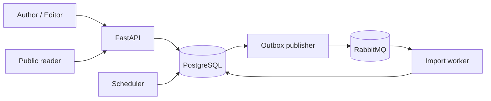

# PublishFlow

Backend редакционной платформы: версии материалов, согласование редактором,
отложенная публикация и пакетный импорт через RabbitMQ.

## История проекта

- первоначальная разработка: август 2024 — апрель 2025 года (период указан
  приблизительно);
- подготовка и публикация портфолио-версии: август 2026 года.

Репозиторий содержит актуализированную и документированную версию проекта,
подготовленную для публичного портфолио.

## Возможности

- регистрация и JWT-аутентификация;
- роли `author`, `editor` и `admin`;
- неизменяемая история версий статьи;
- workflow `draft → in_review → approved → scheduled → published`;
- возврат материала автору с обязательной причиной;
- автоматическая публикация по времени отдельным scheduler-процессом;
- публичная выдача только опубликованных материалов;
- асинхронный пакетный импорт до 100 статей;
- частичный успех импорта: ошибка одной строки не откатывает остальные;
- transactional outbox и идемпотентный import worker;
- PostgreSQL, RabbitMQ, Alembic, OpenAPI, healthcheck и тесты.

## Жизненный цикл статьи



Каждое редактирование создаёт новую запись `article_versions`; опубликованная
версия не переписывается. Недопустимые переходы возвращают `409 Conflict`.

## Архитектура



API атомарно сохраняет бизнес-изменение и событие в outbox. Publisher повторяет
доставку при недоступности RabbitMQ. Import worker безопасно повторно принимает
одно событие и пропускает уже завершённое задание.

## Быстрый запуск

```bash
docker compose up --build --detach
```

После запуска:

- Swagger UI: <http://localhost:8030/docs>;
- healthcheck: <http://localhost:8030/health>;
- RabbitMQ Management: <http://localhost:15683>.

Демонстрационные учётные записи:

```text
admin@example.com / ChangeMe123!
editor@example.com / ChangeMe123!
```

Авторы регистрируются через `POST /api/v1/auth/register`. Для внешнего
окружения скопируйте `.env.example` в `.env` и замените все секреты.

## Тесты и проверки

```bash
docker compose --profile test up --build \
  --abort-on-container-exit --exit-code-from test test
docker compose rm --stop --force --volumes test database-test rabbitmq-test
```

```bash
uv sync --extra dev
uv run ruff format --check .
uv run ruff check .
uv run mypy src
```

## Стек

Python 3.12, FastAPI, Pydantic, SQLAlchemy 2, PostgreSQL 17, RabbitMQ, Pika,
JWT/RBAC, Alembic, Docker Compose, pytest, HTTPX2, Ruff и mypy.

Архитектурные решения и сценарии отказа: [`docs/architecture.md`](./docs/architecture.md).

## English summary

PublishFlow is a containerized editorial-workflow backend with immutable
article versions, role-based review, scheduled publishing and asynchronous
batch imports. A transactional outbox bridges PostgreSQL and RabbitMQ, while
the import worker supports idempotent retries and per-item failures.
